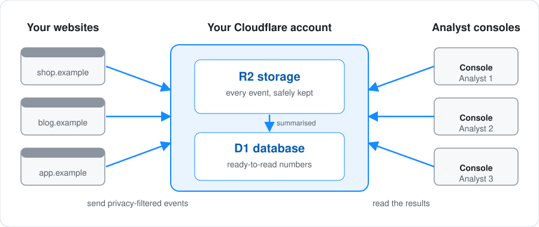
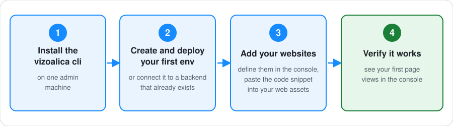

<p align="center">
  
</p>

<p align="center"><strong>Open-source, self-hosted, privacy-first web and product analytics that runs in your own Cloudflare account. One command sets it up, and your visitors' data stays in infrastructure you control.</strong></p>

[](https://github.com/ehud-am/vizoalica/actions/workflows/ci.yml)
[](https://vizoalica.dev)
[](https://github.com/ehud-am/vizoalica/discussions)
[](LICENSE)
[](https://nodejs.org)

**Documentation, a product tour, and a short video: [vizoalica.dev](https://vizoalica.dev).**

**Vizoalica** is an open-source (MIT) web and product analytics platform that you host yourself on
Cloudflare Workers, D1, and R2. A small browser SDK sends privacy-filtered page views and custom events
to your own backend, and a local console shows traffic over time, top pages, referrers, browsers,
devices, unique visitors, and where they are (countries on a world map). Visitor data stays in your own Cloudflare account.

## At a glance

<p align="center">
  
</p>

- **Runs on:** Cloudflare Workers (event ingestion and admin API), D1 (aggregates), and R2 (raw event batches), all in your account.
- **Collects:** page views (each screen of a single-page site, with identifiers such as `/orders/8841` grouped as `/orders/:id`), clicks on buttons and links as **actions**, and custom events, with URLs, referrers, and properties minimised before delivery. It never collects form values, typed text, page text, click positions, or session replay, and it records the consent state on every event.
- **Standards:** CloudEvents batches, JSON Schema validation, and short-lived signed (JWT/JOSE) ingest tokens.
- **Setup:** `npm install -g vizoalica`, then `vizoalica console`; the console walks you through deploying the backend and adding websites. You need Node.js 22 or newer and a Cloudflare account. macOS and Linux are supported; Windows is not yet.
- **License:** MIT.

## Deployment in four steps

Set these up in order, because each step needs something the previous one produces.

<p align="center">
  
</p>

The three parts you end up with:

| Order | Part         | Runs on                             | What it does                                                                                              | Set up with                                          |
| ----- | ------------ | ----------------------------------- | --------------------------------------------------------------------------------------------------------- | ---------------------------------------------------- |
| 1     | **Console**  | An admin's computer, only on demand | A local web app for projects, websites, and analytics. Its browser never holds a remote credential.       | `npm install -g vizoalica`, then `vizoalica console` |
| 2     | **Backend**  | Your Cloudflare account             | Receives signed event batches, filters them, and stores raw events (R2) and bounded aggregates (D1).      | The console's guided **Backend** step                |
| 3     | **Websites** | Wherever each site is hosted        | Loads the browser SDK and a small token endpoint that lets visitors' browsers send events to the backend. | The console's **Websites** panel                     |

Three secrets keep it safe, and none of them is ever in browser code:

| Secret                              | Held by                                                    | You need it to…                         |
| ----------------------------------- | ---------------------------------------------------------- | --------------------------------------- |
| `VIZOALICA_ADMIN_SECRET`            | The Worker and each operator's console                     | Connect another computer as a console   |
| `VIZOALICA_TOKEN_SECRET`            | The Worker and your website's token endpoint (server side) | Set up a website                        |
| `VIZOALICA_ANALYTICS_DIGEST_SECRET` | The Worker only                                            | Nothing day to day; keep it as a backup |

## Step 1: install the console

You need Node.js 22 or newer on macOS or Linux, and a Cloudflare account. No source checkout is required.

```sh
npm install -g vizoalica
vizoalica console
```

`vizoalica console` starts the console on your computer at `http://127.0.0.1:4318` and opens it in your
browser. The first time, it asks who you are (an admin, a website owner, or an analyst) and adapts: for an
admin, it also asks you to name your first **environment** (`dev`, `stage`, `prod`, or any name you choose)
before deploying or connecting a backend. It then keeps you on the path from a running console, to a backend
in your Cloudflare account, to your websites, to results, and shows anything that cannot work yet as
unavailable, with the reason and the next step. Update it with `npm update -g vizoalica` and remove it with
`npm uninstall -g vizoalica`; your settings stay in `~/.config/vizoalica/`.

Everything the console needs is in the package, including deploying a backend (a bundled Worker, its
migrations, and a pinned Wrangler).

**Multiple environments, one console.** An admin can manage more than one independent backend from the same
console — for example `dev`, `stage`, and `prod` — each with its own Worker, database, storage bucket, and
access keys, and its own Cloudflare credential (a plain token or OneCLI). Every resource an environment
creates is named `<environment>-something`, so environments can share one Cloudflare account without
colliding, or each point at a different account. Switch between them from the environment control shown once
more than one exists; a website owner's or analyst's key always fixes their one environment, so they never
see the switcher. See [Get started](docs/get-started.md) for a first environment, and
[operator setup](docs/operations/operator-local.md) for managing more than one.

## Step 2: set up the backend

In the console, follow the guided **Backend** step. It signs you in to Cloudflare, creates the database,
storage bucket, and Worker, and deploys them. There is nothing to copy or edit.

It **generates your three secrets and shows them once**. Save them in a password manager; it never
asks you to invent or paste a key. Setting this up with an AI coding agent? Do this step yourself
in the console: the secrets are shown once and should not pass through an agent conversation.

Later, the same **Backend** page updates the deployed backend (keeping your data and secrets),
rotates a secret, and permanently removes deleted websites and projects. Rotating a secret explains what
it will break before it changes anything: the admin secret cuts off every other console, the token
secret rejects every website's events until updated, and the digest secret restarts unique-visitor
counts. Deleting a website or project is permanent; its data is removed by the daily cleanup.

Full guide: **[docs/operations/cloudflare.md](docs/operations/cloudflare.md)**. Updates and secret
rotation: [backend guide](docs/operations/cloudflare.md#update-an-existing-backend).

**Another computer, another admin.** Install the console there (step 1) and connect it to your existing
backend with the Worker address and the administrator secret. It checks the secret against your Worker before
saving it in a private file (`0600`) on that computer.

> **OneCLI is supported and is the more secure option.** With [OneCLI](https://onecli.sh) the
> administrator secret is held by a gateway and injected into requests to your Worker, so it is
> never written to a file on the operator's computer. It takes a few more setup steps and is not
> the default. The console starts the same way in either mode.

Guides: **[without OneCLI](docs/operations/local-analytics.md)** (the default) or
**[with OneCLI](docs/operations/onecli.md)**. Returning operators:
[Start the local operator console](docs/operations/operator-local.md).

## Step 3: add your websites

In the console, open **Websites** and choose **Add website**. Its first field is an
empty, required project choice; then enter the exact production origin. Saving takes you to that
website's **Install** page, which asks how the site is deployed and then gives numbered steps:

1. **GitHub → Cloudflare Pages** (recommended): add the loader tag to your pages, the generated
   GitHub Actions workflow, and the repository variables and secrets it needs (in GitHub, or with
   the `gh` command), then push. The workflow deploys the site to Cloudflare Pages together with
   Vizoalica's loader and its configuration and token endpoints. The token endpoint needs
   `VIZOALICA_TOKEN_SECRET`, the secret you saved when you set up the backend.
2. **Paste a snippet**: add one script tag to your pages and host the SDK file and a token endpoint
   yourself. Works with any host, including Direct Upload and Git-connected Pages.

Behind the two paths are a **dynamic configuration** (a generic loader and a versioned JSON
document) and a **static snippet** (six values embedded in the page). Both are public browser configuration, not secrets.

Full guide: **[docs/operations/pages.md](docs/operations/pages.md)**; SDK reference:
[docs/operations/browser-sdk.md](docs/operations/browser-sdk.md).

## Step 4: verify it works

Open your site and grant analytics consent, then choose **Check now** on the website's Install page to
see the page views arrive. Want to see the console with data before your own site is connected? The
**Backend** page can add sample page views for a make-believe website, and remove them again.

<p align="center">
  
</p>

_The console showing sample data sent through your own backend._

If a step fails, see [troubleshooting](docs/operations/troubleshooting.md) and resume at that step.

## For contributors: build from source

You do not need this to use Vizoalica. It is for contributors and for anyone who deploys a reviewed tag
or commit from source. You need Node.js 22 or newer, Git, and Corepack, which supplies the pinned pnpm
(9.15.4). The commands below, and the `pnpm vizoalica <command>` entry point in a checkout, are for that
path only.

```sh
git clone https://github.com/ehud-am/vizoalica.git && cd vizoalica
git checkout YOUR_APPROVED_TAG_OR_COMMIT      # deploy a reviewed tag or commit, not a moving branch
corepack enable && corepack prepare pnpm@9.15.4 --activate
pnpm install --frozen-lockfile
pnpm build                                    # compiles every workspace package and the console
pnpm browser-sdk:build                        # script-tag bundles for a website (optional)
```

- **Backend:** Wrangler bundles the Worker from source when you deploy, so there is nothing to
  publish by hand.
- **Console:** `pnpm vizoalica console` runs it from the checkout. Nothing is installed system-wide.
- **Website:** `pnpm browser-sdk:build` writes `packages/browser-sdk/dist/vizoalica.js` and
  `vizoalica-loader.js`, standalone bundles your site hosts itself.

To check a checkout, run `pnpm validate` (type check and all tests), plus `pnpm lint` and
`pnpm format:check`. `pnpm test:e2e` runs the Chromium responsive and accessibility scenarios and
`pnpm coverage` enforces the coverage gates. Prefer the manual, step-by-step install, for example
under an approval process? It is documented in full in the
[backend guide](docs/operations/cloudflare.md#manual-install).

Releases, pushes, tags, and builds never deploy your Worker: an operator deploys a chosen checkout
with the [backend guide](docs/operations/cloudflare.md). A Git-connected **website** may deploy on
its own push; the [website guide](docs/operations/pages.md) explains the difference.

## Privacy defaults

Vizoalica avoids collecting sensitive information by default:

- no raw form values;
- no passwords, payment data, API keys, cookies, or auth headers;
- no raw URL query values;
- no page text, DOM snapshots, heatmaps, or session replay;
- custom properties are filtered by name, type, count, and value length.

Client-side filtering is a convenience, not a trust boundary: the backend also rejects
sensitive-looking payloads before persistence. See [privacy operations](docs/operations/privacy.md).

No custom domain, paid Workers subscription, hosted dashboard, or always-on local process is
required for a small test. Review current Cloudflare pricing and configure retention and usage
alerts; included usage is not a guaranteed spending cap. See the
[cost model](docs/operations/cost-model.md).

## Architecture

```text
Website
  └─ Static browser SDK or generic dynamic loader
      ├─ builds CloudEvents JSON events
      ├─ redacts URL, query, and referrer data
      ├─ queues events in memory with bounded size
      ├─ obtains a short-lived ingest token from the website's own backend
      └─ sends non-blocking event batches

Website backend
  └─ Token issuer: mints short-lived JWT/JOSE-compatible ingest tokens

Cloudflare Worker
  ├─ /healthz, /v1/events:batch, /v1/admin/*
  ├─ token verification and source/origin authorization
  ├─ CloudEvents + JSON Schema validation, event-age and token checks
  ├─ quota and payload-size enforcement, backend privacy guard
  └─ safe metrics and logging

Storage
  ├─ R2: immutable raw JSON event batches
  └─ D1: projects, websites, quotas, audit, and bounded daily/hourly/minute aggregates

Operator machine (on demand)
  ├─ React console → loopback API only
  └─ loopback API → protected Worker administration and aggregates
```

Open standards in use: [CloudEvents](https://cloudevents.io/) envelopes and batches,
[JSON Schema](https://json-schema.org/) validation, short-lived JWT/JOSE-compatible ingest
tokens, and an explicit consent state on every event.

## Get involved

Vizoalica is built in the open, and it gets better when the people who run it help shape it. You
do not need to write code.

- **Share an idea, or ask a question:** [start a discussion](https://github.com/ehud-am/vizoalica/discussions). What would make Vizoalica more useful to you?
- **Something broke or was confusing:** [open an issue](https://github.com/ehud-am/vizoalica/issues/new/choose). A bug report, a docs problem, or a specific request.
- **Show how you run it:** post in [Show and tell](https://github.com/ehud-am/vizoalica/discussions/categories/show-and-tell).
- **Help build it:** pick a [`good first issue`](https://github.com/ehud-am/vizoalica/labels/good%20first%20issue) or a [`help wanted`](https://github.com/ehud-am/vizoalica/labels/help%20wanted) issue, or fix a page with the **Edit this page on GitHub** link on [vizoalica.dev](https://vizoalica.dev/community).

[CONTRIBUTING.md](CONTRIBUTING.md) explains how to propose a bigger change and what the project
holds to (privacy-minimal, self-hosted, easy to audit). Everyone taking part follows the
[code of conduct](CODE_OF_CONDUCT.md), and [SUPPORT.md](SUPPORT.md) says where each kind of question
goes.

## Documentation

| Topic                                                              | Guide                                                                                          |
| ------------------------------------------------------------------ | ---------------------------------------------------------------------------------------------- |
| Deploy, update, rotate, and maintain the backend                   | [Cloudflare backend](docs/operations/cloudflare.md)                                            |
| Console, default (private credential file)                         | [Without OneCLI](docs/operations/local-analytics.md)                                           |
| Console, OneCLI-managed credential                                 | [With OneCLI](docs/operations/onecli.md)                                                       |
| Daily console startup and mode check                               | [Start the console](docs/operations/operator-local.md)                                         |
| Using the console: Analytics, Manage, Geography                    | [Using the console](docs/operations/operator-local.md#using-the-console)                       |
| Register, deploy, verify, and remove a website                     | [Website activation](docs/operations/pages.md)                                                 |
| Browser SDK reference                                              | [Browser SDK](docs/operations/browser-sdk.md)                                                  |
| What is collected and what is not                                  | [Privacy](docs/operations/privacy.md)                                                          |
| Why only country and continent, and not more                       | [Audience attributes review](docs/privacy/audience-attributes-review.md)                       |
| What an owner or analyst key can see, and its environment boundary | [Access keys review](docs/privacy/access-keys-review.md)                                       |
| D1 and R2 cost and capacity                                        | [Cost model](docs/operations/cost-model.md)                                                    |
| Publishing the documentation site (vizoalica.dev)                  | [Publishing this site](docs/operations/docs-site.md)                                           |
| Something failed                                                   | [Troubleshooting](docs/operations/troubleshooting.md)                                          |
| Publishing a release, and making the repository public             | [Releases](docs/operations/releases.md), [public checklist](docs/operations/public-release.md) |
| Getting involved, and where to ask                                 | [Get involved](docs/community.md), [Support](SUPPORT.md)                                       |
| Vulnerability reports, contributing, brand                         | [Security](SECURITY.md), [Contributing](CONTRIBUTING.md), [Brand](docs/brand.md)               |

Vizoalica is released under the [MIT License](LICENSE).
