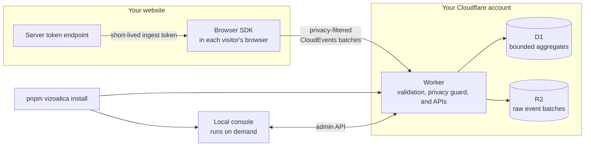
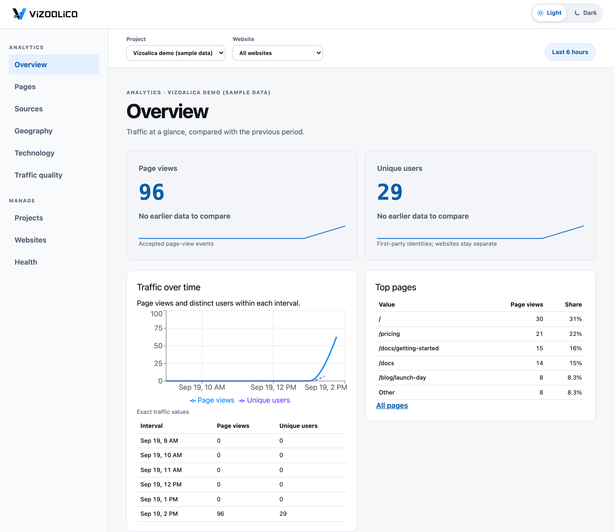

<p align="center">
  
</p>

<p align="center"><strong>Open-source, self-hosted, privacy-first web and product analytics that runs in your own Cloudflare account. One command sets it up, and your visitors' data stays in infrastructure you control.</strong></p>

[](https://github.com/ehud-am/vizoalica/actions/workflows/ci.yml)
[](https://vizoalica.dev)
[](https://github.com/ehud-am/vizoalica/discussions)
[](LICENSE)
[](https://nodejs.org)

**Documentation, a product tour, and a short video: [vizoalica.dev](https://vizoalica.dev).**

**Vizoalica** is an open-source (MIT) web and product analytics platform that you host yourself on
Cloudflare Workers, D1, and R2. A small browser SDK sends privacy-filtered page views and custom events
to your own backend, and a local console shows traffic over time, top pages, referrers, browsers,
devices, unique visitors, and where they are (countries on a world map). Visitor data stays in your own Cloudflare account.

## At a glance



- **Runs on:** Cloudflare Workers (event ingestion and admin API), D1 (aggregates), and R2 (raw event batches), all in your account.
- **Collects:** page views and custom events, with URLs, referrers, and properties minimised before delivery. It never collects form values, page text, or session replay, and it records the consent state on every event.
- **Standards:** CloudEvents batches, JSON Schema validation, and short-lived signed (JWT/JOSE) ingest tokens.
- **Setup:** one command, `pnpm vizoalica install`. You need Node.js 22 or newer, Git, and a Cloudflare account. macOS and Linux are supported; Windows is not yet.
- **License:** MIT.

## The three parts, in order

A Vizoalica installation has three parts. Set them up in this order, because each one needs
something the previous one produces.

```text
  1. BACKEND ─────────────▶ 2. CONSOLE ─────────────▶ 3. WEBSITE
  Cloudflare Worker,        an admin's computer        your site: browser SDK
  database, storage         (Mac or Linux)             + a token endpoint

  produces: the Worker      needs: the Worker address  needs: a website registered in the
  address and 3 secrets            + the admin secret         console + the token secret
```

| Order | Part        | Runs on                                | What it does                                                                                              | Set up with                              |
| ----- | ----------- | -------------------------------------- | --------------------------------------------------------------------------------------------------------- | ---------------------------------------- |
| 1     | **Backend** | Your Cloudflare account                | Receives signed event batches, filters them, and stores raw events (R2) and bounded aggregates (D1).      | `pnpm vizoalica backend` (or `install`)  |
| 2     | **Console** | An operator's computer, only on demand | A local web app for projects, websites, and analytics. Its browser never holds a remote credential.       | `pnpm vizoalica connect` (or `install`)  |
| 3     | **Website** | Wherever your site is hosted           | Loads the browser SDK and a small token endpoint that lets visitors' browsers send events to the backend. | The console's website panel (see step 3) |

Three secrets keep it safe, and none of them is ever in browser code:

| Secret                              | Held by                                                    | You need it to…                         |
| ----------------------------------- | ---------------------------------------------------------- | --------------------------------------- |
| `VIZOALICA_ADMIN_SECRET`            | The Worker and each operator's console                     | Connect another computer as a console   |
| `VIZOALICA_TOKEN_SECRET`            | The Worker and your website's token endpoint (server side) | Set up a website                        |
| `VIZOALICA_ANALYTICS_DIGEST_SECRET` | The Worker only                                            | Nothing day to day; keep it as a backup |

## Quick start

Want to see it working before you plan a production setup? One command does all three parts above
for a demo app: it deploys a real backend to your Cloudflare account, sets up this computer as the
console, and sends sample page views for a make-believe website through that backend, so you are
looking at real analytics about two minutes later.

```sh
git clone https://github.com/ehud-am/vizoalica.git && cd vizoalica
corepack enable && pnpm install
pnpm vizoalica install
```

You need Node.js 22 or newer, Git, and a Cloudflare account. The command asks for almost nothing.
In a rehearsal on a real account (already signed in to Cloudflare) it took under two minutes, most
of it Cloudflare deploying and the numbers appearing:

1. It signs you in to Cloudflare (a browser window opens) and asks whether this is your first
   install. It detects the answer and offers it as the default.
2. It creates the database, storage bucket, and Worker, and deploys them (part 1). There is nothing
   to copy or edit.
3. It **generates your three secrets and shows them once**. You save them in a password manager
   and type `saved`; the screen is then cleared. It never asks you to invent or paste a key.
4. It sets up this computer as an operator console (part 2), and offers to send sample page views
   through your new backend so the console has something real to show (a stand-in for part 3).
5. It starts the console and opens it in your browser.

<p align="center">
  
</p>

_The console after `pnpm vizoalica install`, showing the sample data it sent through your own backend._

The backend it creates is a real one, and only the sample data is throwaway: remove that any time
with `pnpm vizoalica demo --remove`. Setting this up with an AI coding agent? Run
`pnpm vizoalica install` yourself in a terminal. It shows your secrets once, they should not pass
through an agent conversation, and the command refuses to run without an interactive terminal for
that reason. Windows is not supported yet: the console's private-file permission checks and the
deploy scripts assume macOS or Linux.

**Ready for production?** The quick start does not connect a website of yours. Read the next
section to do that, and to install on another computer, choose your own names, use OneCLI, or
update an existing backend.

## Production deployment, part by part

The quick start already did parts 1 and 2 on this computer. Use this section to do the parts one at
a time: add another operator, choose your own names, use OneCLI, update the backend, or connect your
real website (part 3), which the quick start only simulates.

### 1. Backend — first

```sh
pnpm vizoalica backend
```

Asks **first install or update?** and does the right thing. A first install creates everything and
generates the secrets. An update deploys this checkout over your existing install and keeps your
data and secrets. It never adopts an existing database, and if a first install fails part-way it
offers to remove only the empty resources it just created.

Full guide: **[docs/operations/cloudflare.md](docs/operations/cloudflare.md)**.

### 2. Console — second

Run this on every computer that should administer Vizoalica. The first one is set up by
`pnpm vizoalica install`; for any other, check out the repository, run `corepack enable && pnpm install`,
and then:

```sh
pnpm vizoalica connect        # asks for the Worker address and the administrator secret (hidden)
pnpm vizoalica console        # starts the console; open http://127.0.0.1:5173
```

`connect` checks the secret against your Worker before it writes anything, then saves it in a
private file (`0600`, outside the repository).

> **OneCLI is supported and is the more secure option.** With [OneCLI](https://onecli.sh) the
> administrator secret is held by a gateway and injected into requests to your Worker, so it is
> never written to a file on the operator's computer. It takes a few more setup steps and is not
> the default. `pnpm vizoalica console` starts the console the same way in either mode.

Full guides: **[without OneCLI](docs/operations/local-analytics.md)** (the default) or
**[with OneCLI](docs/operations/onecli.md)**. Returning operators:
[Start the local operator console](docs/operations/operator-local.md).

### 3. Website — third

In the console, open **Websites** and choose **Add website**. Its first field is an
empty, required project choice; then enter the exact production origin. Saving takes you to that
website's **Install** page, which asks how the site is deployed and then gives numbered steps:

1. **GitHub → Cloudflare Pages** (recommended): add the loader tag to your pages, the generated
   GitHub Actions workflow, and the repository variables and secrets it needs (in GitHub, or with
   the `gh` command), then push. The workflow deploys the site to Cloudflare Pages together with
   Vizoalica's loader and its configuration and token endpoints. The token endpoint needs
   `VIZOALICA_TOKEN_SECRET`, the secret you saved during step 1.
2. **Paste a snippet**: add one script tag to your pages and host the SDK file and a token endpoint
   yourself. Works with any host, including Direct Upload and Git-connected Pages.
3. Open the site, grant analytics consent, and choose **Check now** on the Install page to see the
   page views arrive.

Behind the two paths are a **dynamic configuration** (a generic loader and a versioned JSON
document) and a **static snippet** (six values embedded in the page). Both are public browser configuration, not secrets.

Full guide: **[docs/operations/pages.md](docs/operations/pages.md)**; SDK reference:
[docs/operations/browser-sdk.md](docs/operations/browser-sdk.md).

If a step fails, see [troubleshooting](docs/operations/troubleshooting.md) and resume at that step.

## Keep it running

`pnpm vizoalica` is the operator's single entry point. It never accepts a secret as an argument.

| Command                                             | What it does                                                                     |
| --------------------------------------------------- | -------------------------------------------------------------------------------- |
| `pnpm vizoalica install`                            | First-time setup, start to finish: backend, this computer, sample data, console. |
| `pnpm vizoalica backend`                            | Install or update the Cloudflare backend.                                        |
| `pnpm vizoalica connect`                            | Set up this computer as an operator console.                                     |
| `pnpm vizoalica console`                            | Start the private local API and the web console (`run` is an alias).             |
| `pnpm vizoalica demo`                               | Add sample data; `--remove` deletes it permanently.                              |
| `pnpm vizoalica rotate <admin\|token\|digest\|all>` | Replace a secret, show the new value once, and update this computer.             |
| `pnpm vizoalica purge-deleted`                      | Dry-run; add `--apply` to permanently remove deleted websites and projects.      |
| `pnpm vizoalica status` / `verify`                  | Show the credential mode and access checks, or just verify authenticated access. |
| `pnpm vizoalica setup` / `doctor`                   | OneCLI mode: save its non-secret settings, and check its prerequisites.          |
| `pnpm vizoalica deploy-pages`                       | Upload a Pages site with native Wrangler, then verify it.                        |
| `pnpm vizoalica help` / `pnpm vizoalica show`       | List the commands, or where each parameter comes from.                           |

To run it from any directory, link it once from the checkout with `pnpm link --global`; then
`vizoalica <command>` works everywhere (its messages still print the `pnpm vizoalica` form).

Rotating a secret explains what it will break before it changes anything: the admin secret cuts
off every other console, the token secret rejects every website's events until updated, and the
digest secret restarts unique-visitor counts. Deleting a website or project is permanent; its
data is removed by the daily cleanup. Details:
[backend guide](docs/operations/cloudflare.md#update-an-existing-backend).

## Build from source

Vizoalica is distributed as source. Nothing is published to npm or another registry, and every
part is built from this repository. You need Node.js 22 or newer, Git, and Corepack, which supplies
the pinned pnpm (9.15.4).

```sh
git clone https://github.com/ehud-am/vizoalica.git && cd vizoalica
git checkout YOUR_APPROVED_TAG_OR_COMMIT      # deploy a reviewed tag or commit, not a moving branch
corepack enable && corepack prepare pnpm@9.15.4 --activate
pnpm install --frozen-lockfile
pnpm build                                    # compiles every workspace package and the console
pnpm browser-sdk:build                        # script-tag bundles for a website (optional)
```

`pnpm vizoalica install` and `pnpm vizoalica backend` run `pnpm build` for you.

- **Backend:** Wrangler bundles the Worker from source when you deploy, so there is nothing to
  publish by hand.
- **Console:** `pnpm vizoalica console` runs it from the checkout. Nothing is installed system-wide.
- **Website:** `pnpm browser-sdk:build` writes `packages/browser-sdk/dist/vizoalica.js` and
  `vizoalica-loader.js`, standalone bundles your site hosts itself.

To check a checkout, run `pnpm validate` (type check and all tests), plus `pnpm lint` and
`pnpm format:check`. `pnpm test:e2e` runs the Chromium responsive and accessibility scenarios and
`pnpm coverage` enforces the coverage gates. Prefer the manual, step-by-step install, for example
under an approval process? It is documented in full in the
[backend guide](docs/operations/cloudflare.md#manual-install).

Releases, pushes, tags, and builds never deploy your Worker: an operator deploys a chosen checkout
with the [backend guide](docs/operations/cloudflare.md). A Git-connected **website** may deploy on
its own push; the [website guide](docs/operations/pages.md) explains the difference.

## Privacy defaults

Vizoalica avoids collecting sensitive information by default:

- no raw form values;
- no passwords, payment data, API keys, cookies, or auth headers;
- no raw URL query values;
- no page text, DOM snapshots, heatmaps, or session replay;
- custom properties are filtered by name, type, count, and value length.

Client-side filtering is a convenience, not a trust boundary: the backend also rejects
sensitive-looking payloads before persistence. See [privacy operations](docs/operations/privacy.md).

No custom domain, paid Workers subscription, hosted dashboard, or always-on local process is
required for a small test. Review current Cloudflare pricing and configure retention and usage
alerts; included usage is not a guaranteed spending cap. See the
[cost model](docs/operations/cost-model.md).

## Architecture

```text
Website
  └─ Static browser SDK or generic dynamic loader
      ├─ builds CloudEvents JSON events
      ├─ redacts URL, query, and referrer data
      ├─ queues events in memory with bounded size
      ├─ obtains a short-lived ingest token from the website's own backend
      └─ sends non-blocking event batches

Website backend
  └─ Token issuer: mints short-lived JWT/JOSE-compatible ingest tokens

Cloudflare Worker
  ├─ /healthz, /v1/events:batch, /v1/admin/*
  ├─ token verification and source/origin authorization
  ├─ CloudEvents + JSON Schema validation, event-age and token checks
  ├─ quota and payload-size enforcement, backend privacy guard
  └─ safe metrics and logging

Storage
  ├─ R2: immutable raw JSON event batches
  └─ D1: projects, websites, quotas, audit, and bounded daily/hourly/minute aggregates

Operator machine (on demand)
  ├─ React console → loopback API only
  └─ loopback API → protected Worker administration and aggregates
```

Open standards in use: [CloudEvents](https://cloudevents.io/) envelopes and batches,
[JSON Schema](https://json-schema.org/) validation, short-lived JWT/JOSE-compatible ingest
tokens, and an explicit consent state on every event.

## Get involved

Vizoalica is built in the open, and it gets better when the people who run it help shape it. You
do not need to write code.

- **Share an idea, or ask a question:** [start a discussion](https://github.com/ehud-am/vizoalica/discussions). What would make Vizoalica more useful to you?
- **Something broke or was confusing:** [open an issue](https://github.com/ehud-am/vizoalica/issues/new/choose). A bug report, a docs problem, or a specific request.
- **Show how you run it:** post in [Show and tell](https://github.com/ehud-am/vizoalica/discussions/categories/show-and-tell).
- **Help build it:** pick a [`good first issue`](https://github.com/ehud-am/vizoalica/labels/good%20first%20issue) or a [`help wanted`](https://github.com/ehud-am/vizoalica/labels/help%20wanted) issue, or fix a page with the **Edit this page on GitHub** link on [vizoalica.dev](https://vizoalica.dev/community).

[CONTRIBUTING.md](CONTRIBUTING.md) explains how to propose a bigger change and what the project
holds to (privacy-minimal, self-hosted, easy to audit). Everyone taking part follows the
[code of conduct](CODE_OF_CONDUCT.md), and [SUPPORT.md](SUPPORT.md) says where each kind of question
goes.

## Documentation

| Topic                                                  | Guide                                                                                          |
| ------------------------------------------------------ | ---------------------------------------------------------------------------------------------- |
| Deploy, update, rotate, and maintain the backend       | [Cloudflare backend](docs/operations/cloudflare.md)                                            |
| Console, default (private credential file)             | [Without OneCLI](docs/operations/local-analytics.md)                                           |
| Console, OneCLI-managed credential                     | [With OneCLI](docs/operations/onecli.md)                                                       |
| Daily console startup and mode check                   | [Start the console](docs/operations/operator-local.md)                                         |
| Using the console: Analytics, Manage, Geography        | [Using the console](docs/operations/operator-local.md#using-the-console)                       |
| Register, deploy, verify, and remove a website         | [Website activation](docs/operations/pages.md)                                                 |
| Browser SDK reference                                  | [Browser SDK](docs/operations/browser-sdk.md)                                                  |
| What is collected and what is not                      | [Privacy](docs/operations/privacy.md)                                                          |
| Why only country and continent, and not more           | [Audience attributes review](docs/privacy/audience-attributes-review.md)                       |
| D1 and R2 cost and capacity                            | [Cost model](docs/operations/cost-model.md)                                                    |
| Publishing the documentation site (vizoalica.dev)      | [Publishing this site](docs/operations/docs-site.md)                                           |
| Something failed                                       | [Troubleshooting](docs/operations/troubleshooting.md)                                          |
| Publishing a release, and making the repository public | [Releases](docs/operations/releases.md), [public checklist](docs/operations/public-release.md) |
| Getting involved, and where to ask                     | [Get involved](docs/community.md), [Support](SUPPORT.md)                                       |
| Vulnerability reports, contributing, brand             | [Security](SECURITY.md), [Contributing](CONTRIBUTING.md), [Brand](docs/brand.md)               |

Vizoalica is released under the [MIT License](LICENSE).
