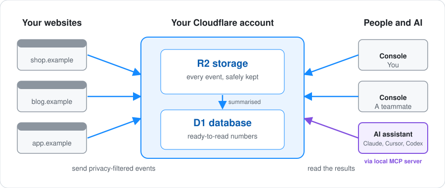
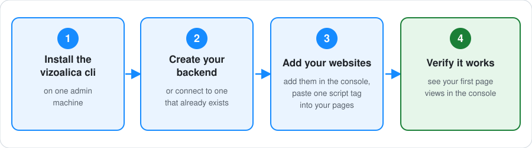
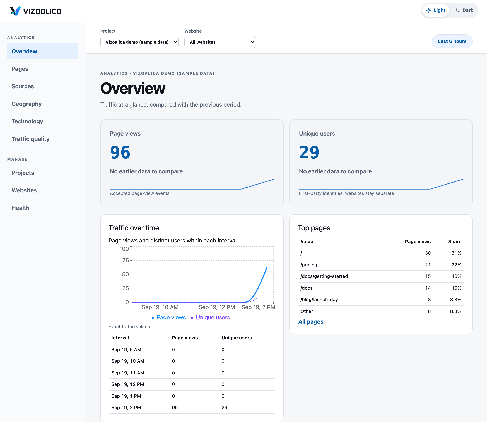

<p align="center">
  
</p>

<p align="center"><strong>Web analytics your AI assistant can read. Open source and cookieless, running in your own Cloudflare account: ask Claude, Cursor, or Codex how your site is doing, and it answers from your own data.</strong></p>

[](https://github.com/ehud-am/vizoalica/actions/workflows/ci.yml)
[](https://vizoalica.dev)
[](https://github.com/ehud-am/vizoalica/discussions)
[](LICENSE)
[](https://nodejs.org)

**Documentation, a product tour, and a short video: [vizoalica.dev](https://vizoalica.dev).**

**Vizoalica** is an open-source (MIT) web and product analytics platform that you host yourself on
Cloudflare Workers, D1, and R2. One script tag on your site sends privacy-filtered page views, clicks,
and custom events to your own backend. A local console shows traffic over time, top pages, referrers,
browsers, devices, unique visitors, and countries, and a local MCP server lets your AI assistant
answer questions from the same data. Visitor data stays in your own Cloudflare account.

## At a glance

<p align="center">
  
</p>

- **Ask your AI assistant:** a local, read-only MCP server and skill for Claude Code, Claude Desktop, Codex, and Cursor ("How did my websites do last week?"). See [Use Vizoalica with AI](docs/operations/ai.md).
- **Install on a website:** one script tag, on any host. Nothing is stored in the browser: no cookies, no local storage.
- **Runs on:** Cloudflare Workers (event ingestion and admin API), D1 (aggregates), and R2 (raw event batches), all in your account.
- **Collects:** page views (each screen of a single-page site, with identifiers such as `/orders/8841` grouped as `/orders/:id`), clicks on buttons and links as **actions**, and custom events, with URLs, referrers, and properties minimised before delivery. It never collects form values, typed text, page text, click positions, or session replay, and it records the consent state on every event.
- **Standards:** CloudEvents batches, JSON Schema validation, and optional short-lived signed (JWT/JOSE) ingest tokens.
- **Setup:** `npm install -g vizoalica`, `vizoalica env add prod` (deploys the backend to your Cloudflare account, explaining each question), then `vizoalica console`. You need Node.js 22 or newer and a Cloudflare account. macOS and Linux are supported; Windows is not yet.
- **License:** MIT.

## Deployment in four steps

Set these up in order, because each step needs something the previous one produces.

<p align="center">
  
</p>

The three parts you end up with:

| Order | Part         | Runs on                             | What it does                                                                                             | Set up with                                          |
| ----- | ------------ | ----------------------------------- | -------------------------------------------------------------------------------------------------------- | ---------------------------------------------------- |
| 1     | **Console**  | An admin's computer, only on demand | A local web app for projects, websites, and analytics. Its browser never holds a remote credential.      | `npm install -g vizoalica`, then `vizoalica console` |
| 2     | **Backend**  | Your Cloudflare account             | Serves the script, receives event batches, filters them, and stores raw events (R2) and aggregates (D1). | `vizoalica deploy <name> --apply`                    |
| 3     | **Websites** | Wherever each site is hosted        | One script tag. Optionally, a small token endpoint for signed events.                                    | The console's **Websites** panel                     |

The backend has three secrets, and none of them is ever in browser code. `vizoalica env add` saves the first for
you and shows none of them:

| Secret                              | Held by                                                    | You need it to…                          |
| ----------------------------------- | ---------------------------------------------------------- | ---------------------------------------- |
| `VIZOALICA_ADMIN_SECRET`            | The Worker and each admin's console                        | Connect another computer as a console    |
| `VIZOALICA_TOKEN_SECRET`            | The Worker and your website's token endpoint (server side) | Set up a website that uses signed tokens |
| `VIZOALICA_ANALYTICS_DIGEST_SECRET` | The Worker only                                            | Nothing                                  |

## Step 1: Install the vizoalica cli

You need Node.js 22 or newer on macOS or Linux, and a Cloudflare account. No source checkout is required.

```sh
npm install -g vizoalica
vizoalica help
```

Update with `npm update -g vizoalica`; remove with `npm uninstall -g vizoalica`. Your settings stay in
`~/.config/vizoalica/`.

**Something not working?** Add `--verbose` to any command (for example `vizoalica deploy prod --apply --verbose`).
It prints, with timings, what the command is doing: the files and settings it uses, each question it asks, each
request it makes, and each Wrangler step with its output. It never prints a secret, a credential, or your
answers, so the output is safe to paste into an issue.

## Step 2: Create your backend

One command creates your backend in your Cloudflare account and saves it on this computer:

```sh
vizoalica env add prod
```

Have a Cloudflare API token ready with **Workers Scripts: Edit, D1: Edit, Workers R2 Storage: Edit, and Account
Settings: Read** (My Profile → API Tokens → Create Token → Custom token), and R2 enabled on the account. It asks
one question at a time and explains each. Say **yes** to deploying. It creates a D1 database, an R2 bucket, and
a Worker named `prod-vizoalica-…`, then checks that they work. It never changes or deletes anything that already
exists, and Ctrl-C stops without changing anything. Add `--verbose` to see each step.

**There is no secret to copy.** The administrator secret is saved in `~/.config/vizoalica/environments.json`,
readable only by you, and never printed. The token secret is needed only by websites that require signed
tokens; get it when you first need it with `vizoalica rotate prod token`. Setting this up with an AI coding
agent? Run this step yourself, so your Cloudflare API token does not pass through an agent conversation.

To script it, give the answers as options; a script needs no terminal:

```sh
export CLOUDFLARE_API_TOKEN=...
vizoalica env add prod --deploy --yes
```

Deploying is also a command of its own (`vizoalica deploy prod` shows the plan, `--apply` creates it, and
`--update` brings it to the installed version). See [Create a backend](docs/operations/deploy.md).

**Then open the console:**

```sh
vizoalica console
```

It starts the console on your computer at `http://127.0.0.1:4318` and opens it in your browser. If something is
not set up yet, a welcome page says what is wrong and which command fixes it. The console does not deploy or
update a backend; update one with `vizoalica deploy <name> --update`.

**More than one backend, or someone else's.** Say **no** to deploying to connect to a backend that already
exists, with the access key you were given. Run `vizoalica env add` once per name to keep `dev` and `prod` side
by side; a picker in the console switches between them. See
[Run more than one backend](docs/operations/environments.md) and [Share with someone](docs/operations/share.md).
To keep secrets in a vault instead of a file, see [OneCLI](docs/operations/onecli.md).

Returning operators: [Start the console day to day](docs/operations/operator-local.md).

## Step 3: add your websites

In the console, open **Websites** and choose **Add website**. Its first field is an
empty, required project choice; then enter the site's address. Saving takes you to that
website's **Install** page, which shows **one script tag** to paste into your pages:

```html
<script
  defer
  src="https://prod-vizoalica.<you>.workers.dev/vizoalica.js"
  data-source="<website key>"
  data-token-url="none"
></script>
```

Your backend serves the script, and it accepts events only from the addresses you entered for the
website. Any host works: GitHub Pages, Netlify, WordPress, or plain HTML. Nothing is stored in your
visitors' browsers; unique visitors are counted with an identifier that changes every day (see
[privacy defaults](#privacy-defaults)).

**Signed tokens (optional).** Turn on **Require a signed token** for a website whose server can run a
small function, so fake events are harder to send. The Install page then offers two paths:
**GitHub → Cloudflare Pages** (a generated workflow deploys your site with Vizoalica's
**dynamic configuration** and token endpoint) or **Paste a snippet** (a **static snippet**, with an
SDK file and token endpoint you host). The token endpoint needs `VIZOALICA_TOKEN_SECRET`; get it with
`vizoalica rotate <backend> token` the first time. The values in either snippet are public browser configuration,
not secrets.

Full guide: **[docs/operations/pages.md](docs/operations/pages.md)**; SDK reference:
[docs/operations/browser-sdk.md](docs/operations/browser-sdk.md).

## Step 4: verify it works

Open your site, then choose **Check now** on the website's Install page to see the page views arrive. Want to see the console with data before your own site is connected? From a source
checkout, `pnpm vizoalica demo --env <name>` adds sample page views for a make-believe website
(`pnpm vizoalica demo --env <name> --remove` deletes them).

<p align="center">
  
</p>

_The console showing sample data sent through your own backend._

If a step fails, see [troubleshooting](docs/operations/troubleshooting.md) and resume at that step. A
signed-token website whose events are rejected with `invalid_signature` has a different
`VIZOALICA_TOKEN_SECRET` from its Worker.

## Ask an AI assistant

Let Claude, Codex, or Cursor answer questions about your analytics and the health of your backends, read-only:

```sh
vizoalica mcp install --client claude-code      # or claude-desktop, codex, cursor
vizoalica skill install --client claude-code    # or codex
```

The MCP server runs on your computer, works on every environment you have, names the environment in every
answer, and never hands a secret to the AI client. See [Use Vizoalica with AI](docs/operations/ai.md).

## For contributors: build from source

You do not need this to use Vizoalica. It is for contributors and for anyone who deploys a reviewed tag
or commit from source. You need Node.js 22 or newer, Git, and Corepack, which supplies the pinned pnpm
(9.15.4). The commands below, and the `pnpm vizoalica <command>` entry point in a checkout, are for that
path only.

```sh
git clone https://github.com/ehud-am/vizoalica.git && cd vizoalica
git checkout YOUR_APPROVED_TAG_OR_COMMIT      # deploy a reviewed tag or commit, not a moving branch
corepack enable && corepack prepare pnpm@9.15.4 --activate
pnpm install --frozen-lockfile
pnpm build                                    # compiles every workspace package and the console
pnpm browser-sdk:build                        # script-tag bundles for a website (optional)
```

- **Backend:** Wrangler bundles the Worker from source when you deploy, so there is nothing to
  publish by hand.
- **Console:** `pnpm vizoalica console` runs it from the checkout. Nothing is installed system-wide.
- **Website:** the Worker serves the SDK at `/vizoalica.js`. For a signed-token website that hosts
  its own copy, `pnpm browser-sdk:build` writes `packages/browser-sdk/dist/vizoalica.js` and
  `vizoalica-loader.js`. The same build refreshes the Worker's copy in
  `apps/ingest-worker/src/generated/`.

To check a checkout, run `pnpm validate` (type check and all tests), plus `pnpm lint` and
`pnpm format:check`. `pnpm test:e2e` runs the Chromium responsive and accessibility scenarios and
`pnpm coverage` enforces the coverage gates. Prefer the manual, step-by-step install, for example
under an approval process? It is documented in full in the
[backend guide](docs/operations/cloudflare.md#manual-install).

Releases, pushes, tags, and builds never deploy your Worker: an operator does, with
`vizoalica deploy` ([guide](docs/operations/deploy.md)) or from a chosen checkout with the
[backend guide](docs/operations/cloudflare.md). A Git-connected **website** may deploy on
its own push; the [website guide](docs/operations/pages.md) explains the difference.

## Privacy defaults

Vizoalica avoids collecting sensitive information by default:

- nothing stored in the visitor's browser: no cookies or local storage. Unique visitors are counted
  by the backend with a daily-rotating identifier whose daily salt is deleted after the day ends;
- no raw form values;
- no passwords, payment data, API keys, cookies, or auth headers;
- no raw URL query values;
- no page text, DOM snapshots, heatmaps, or session replay;
- custom properties are filtered by name, type, count, and value length.

Client-side filtering is a convenience, not a trust boundary: the backend also rejects
sensitive-looking payloads before persistence. See [privacy operations](docs/operations/privacy.md).

No custom domain, paid Workers subscription, hosted dashboard, or always-on local process is
required for a small test. Review current Cloudflare pricing and configure retention and usage
alerts; included usage is not a guaranteed spending cap. See the
[cost model](docs/operations/cost-model.md).

## Architecture

```text
Website
  └─ One script tag: the browser SDK, served by your Worker
      ├─ builds CloudEvents JSON events
      ├─ redacts URL, query, and referrer data; stores nothing in the browser
      ├─ queues events in memory with bounded size
      ├─ optionally obtains a short-lived ingest token from the website's own server
      └─ sends non-blocking event batches

Cloudflare Worker
  ├─ /vizoalica.js, /healthz, /v1/events:batch, /v1/admin/*
  ├─ origin authorization, and token verification for signed-token websites
  ├─ daily-rotating visitor identifier (salt deleted after each day)
  ├─ CloudEvents + JSON Schema validation, event-age and token checks
  ├─ quota and payload-size enforcement, backend privacy guard
  └─ safe metrics and logging

Storage
  ├─ R2: immutable raw JSON event batches
  └─ D1: projects, websites, quotas, audit, and bounded daily/hourly/minute aggregates

Your computer (on demand)
  ├─ React console → loopback API → Worker administration and aggregates
  └─ AI assistant → local MCP server (read-only) → the same aggregates
```

Open standards in use: [CloudEvents](https://cloudevents.io/) envelopes and batches,
[JSON Schema](https://json-schema.org/) validation, optional short-lived JWT/JOSE-compatible ingest
tokens, the [Model Context Protocol](https://modelcontextprotocol.io/), and an explicit consent state
on every event.

## Get involved

Vizoalica is built in the open, and it gets better when the people who run it help shape it. You
do not need to write code.

- **Share an idea, or ask a question:** [start a discussion](https://github.com/ehud-am/vizoalica/discussions). What would make Vizoalica more useful to you?
- **Something broke or was confusing:** [open an issue](https://github.com/ehud-am/vizoalica/issues/new/choose). A bug report, a docs problem, or a specific request.
- **Show how you run it:** post in [Show and tell](https://github.com/ehud-am/vizoalica/discussions/categories/show-and-tell).
- **Help build it:** pick a [`good first issue`](https://github.com/ehud-am/vizoalica/labels/good%20first%20issue) or a [`help wanted`](https://github.com/ehud-am/vizoalica/labels/help%20wanted) issue, or fix a page with the **Edit this page on GitHub** link on [vizoalica.dev](https://vizoalica.dev/community).

[CONTRIBUTING.md](CONTRIBUTING.md) explains how to propose a bigger change and what the project
holds to (privacy-minimal, self-hosted, easy to audit). Everyone taking part follows the
[code of conduct](CODE_OF_CONDUCT.md), and [SUPPORT.md](SUPPORT.md) says where each kind of question
goes.

## Documentation

| Topic                                                              | Guide                                                                                          |
| ------------------------------------------------------------------ | ---------------------------------------------------------------------------------------------- |
| Create a backend, and replace its secrets (`deploy`, `rotate`)     | [Create a backend](docs/operations/deploy.md)                                                  |
| Environments and `vizoalica env`                                   | [Environments](docs/operations/environments.md)                                                |
| Ask Claude, Codex, or Cursor about your analytics (MCP and skill)  | [Use Vizoalica with AI](docs/operations/ai.md)                                                 |
| Deploy, update, and maintain the backend from a source checkout    | [Cloudflare backend](docs/operations/cloudflare.md)                                            |
| Console from a checkout, private credential file                   | [Without OneCLI](docs/operations/local-analytics.md)                                           |
| Console, OneCLI-managed credential                                 | [With OneCLI](docs/operations/onecli.md)                                                       |
| Daily console startup and mode check                               | [Start the console](docs/operations/operator-local.md)                                         |
| Using the console: Analytics, Manage, Geography                    | [Using the console](docs/operations/operator-local.md#using-the-console)                       |
| Register, deploy, verify, and remove a website                     | [Website activation](docs/operations/pages.md)                                                 |
| Browser SDK reference                                              | [Browser SDK](docs/operations/browser-sdk.md)                                                  |
| What is collected and what is not                                  | [Privacy](docs/operations/privacy.md)                                                          |
| Why only country and continent, and not more                       | [Audience attributes review](docs/privacy/audience-attributes-review.md)                       |
| What an owner or analyst key can see, and its environment boundary | [Access keys review](docs/privacy/access-keys-review.md)                                       |
| D1 and R2 cost and capacity                                        | [Cost model](docs/operations/cost-model.md)                                                    |
| Publishing the documentation site (vizoalica.dev)                  | [Publishing this site](docs/operations/docs-site.md)                                           |
| Something failed                                                   | [Troubleshooting](docs/operations/troubleshooting.md)                                          |
| Publishing a release, and making the repository public             | [Releases](docs/operations/releases.md), [public checklist](docs/operations/public-release.md) |
| Getting involved, and where to ask                                 | [Get involved](docs/community.md), [Support](SUPPORT.md)                                       |
| Vulnerability reports, contributing, brand                         | [Security](SECURITY.md), [Contributing](CONTRIBUTING.md), [Brand](docs/brand.md)               |

Vizoalica is released under the [MIT License](LICENSE).
