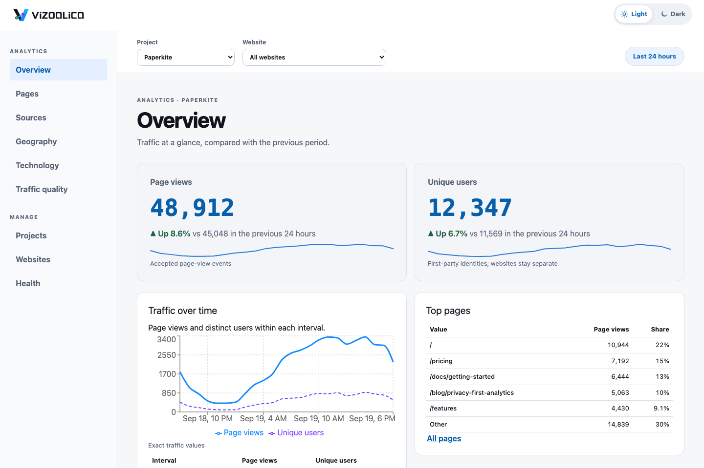
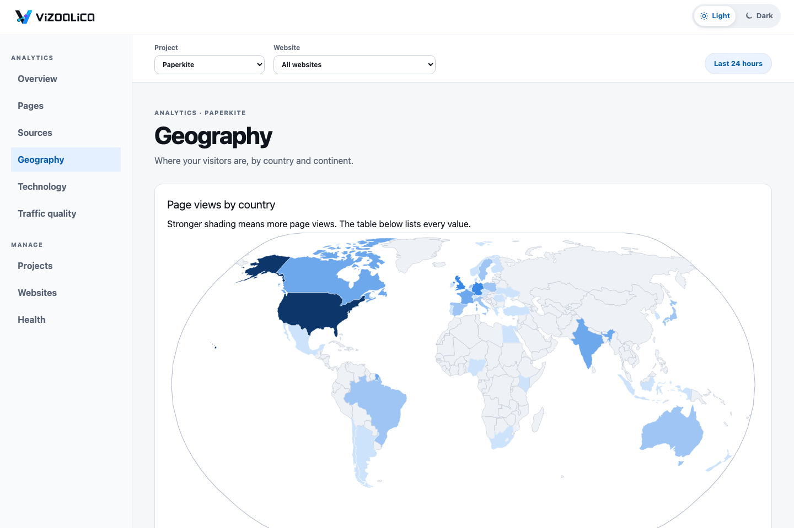
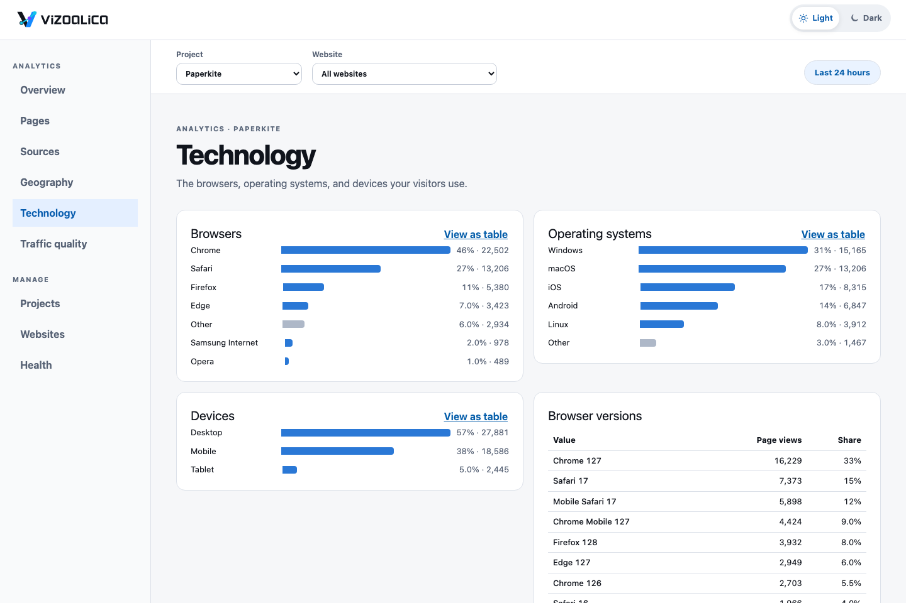
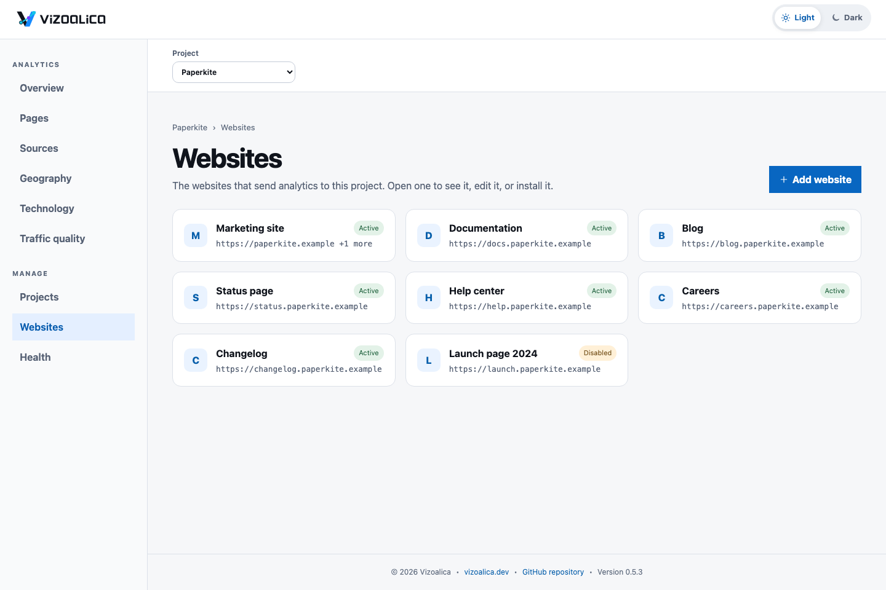
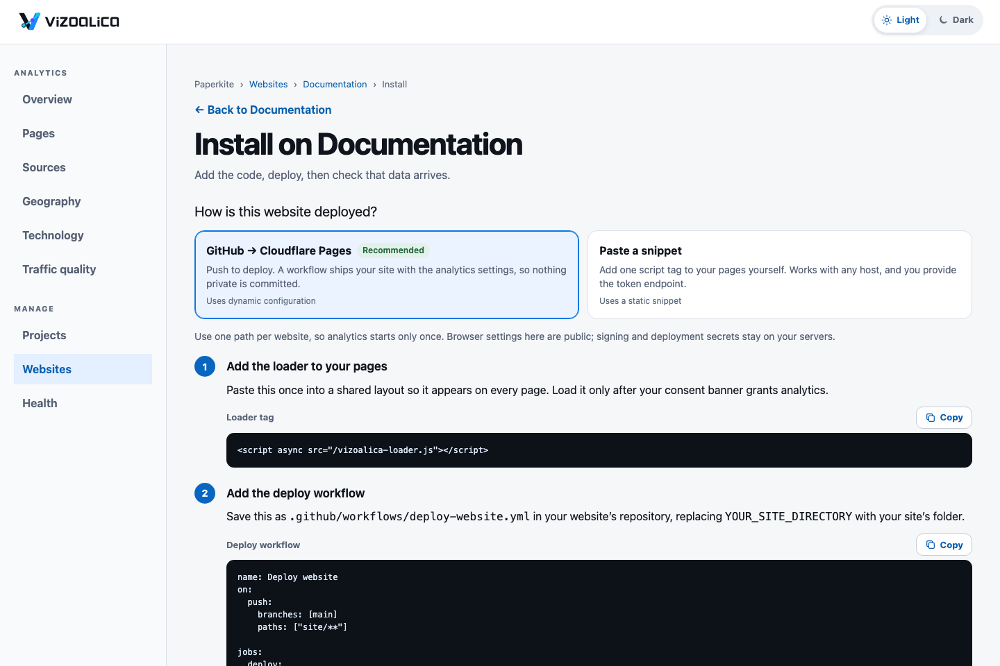
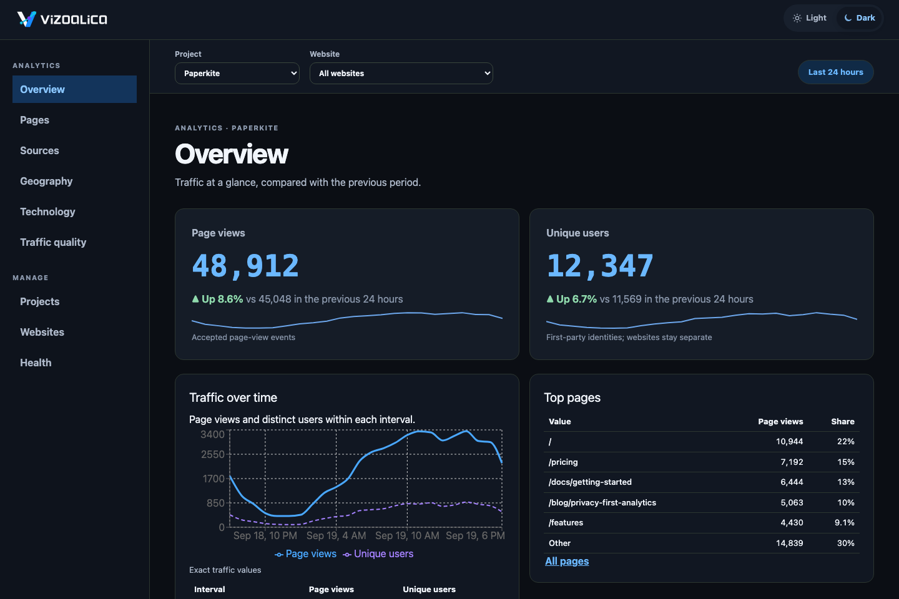

# Product tour

A look at the console. Everything on this page is **fictional demo data** for an invented company, Paperkite, on reserved example domains. Nothing here is real traffic.

<figure class="tour-shot">

<figcaption><strong>Overview.</strong> Headline numbers with the change against the previous period, traffic over time, and the top pages, sources, and countries.</figcaption>
</figure>

<figure class="tour-shot">

<figcaption><strong>Geography.</strong> Countries by full name on a world map, a table of every country, and totals by continent. The map ships with the console and makes no network requests. Only country and continent are collected: see the <a href="/privacy/audience-attributes-review">audience attributes review</a>.</figcaption>
</figure>

<figure class="tour-shot">

<figcaption><strong>Technology.</strong> Browsers, operating systems, and devices as readable bars, each with a table view.</figcaption>
</figure>

<figure class="tour-shot">

<figcaption><strong>Websites.</strong> One card per website. Open one for its own page with status, identifiers, and actions; editing and adding are pages of their own.</figcaption>
</figure>

<figure class="tour-shot">

<figcaption><strong>Install.</strong> Say how the website is deployed, then follow numbered steps, each with one action. The last step, <em>Check now</em>, confirms that page views are arriving.</figcaption>
</figure>

<figure class="tour-shot">

<figcaption><strong>Dark theme.</strong> Every screen has a dark theme that follows your system or your choice.</figcaption>
</figure>

The console has two areas: <strong>Analytics</strong> for reading, where nothing can be changed, and <strong>Manage</strong> for setup. See <a href="/operations/operator-local">start the local operator console</a>.

Ready to try it? [Read the quick start](/get-started).
